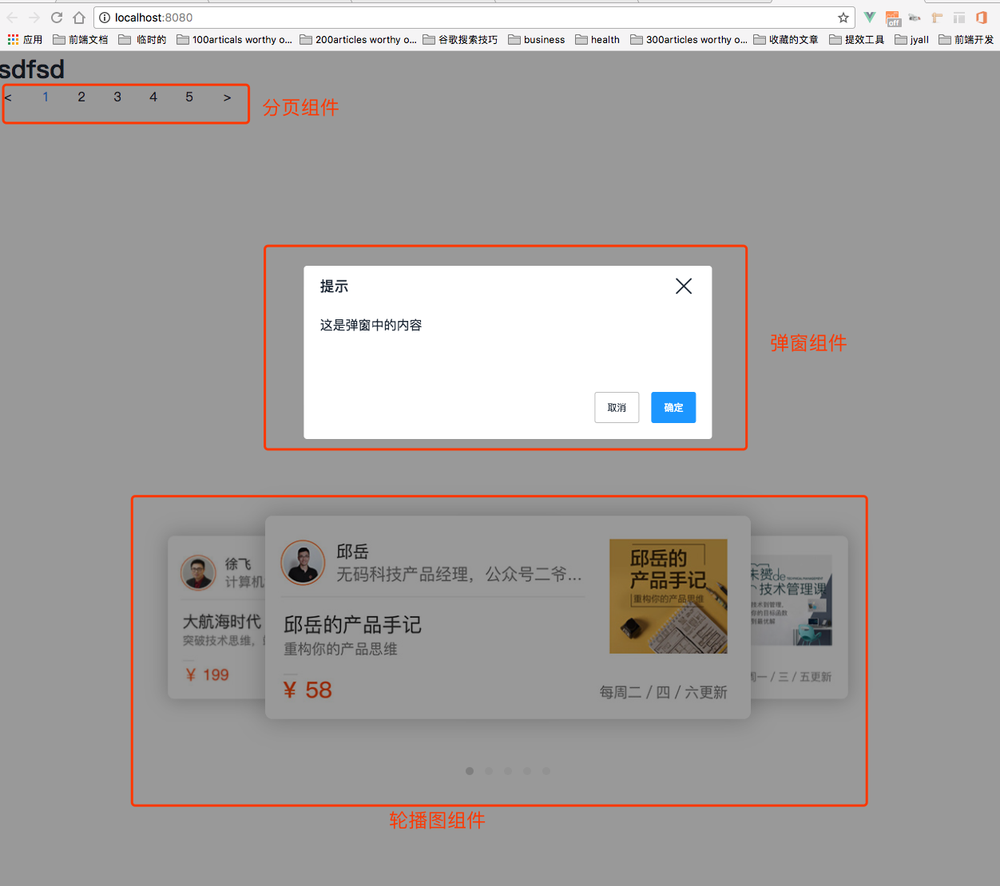

# vue-component

> write some components on my own

## Build Setup

``` bash
# install dependencies
npm install

# serve with hot reload at localhost:8080
npm run dev

# build for production with minification
npm run build
```

For detailed explanation on how things work, consult the [docs for vue-loader](http://vuejs.github.io/vue-loader).


## 成果




### 参考资料
- [一个vue2.0的编写教程](https://github.com/wangzianan/my_component)


### 项目搭建（起步）
项目使用是vue-cli脚手架，开始的项目搭建这么来
- npm install -g vue-cli --registry=https://registry.npm.taobao.org
- vue init webpack-simple my-project
- cd my-project
- npm install --registry=https://registry.npm.taobao.org
- npm run dev


### 思路

#### vue分页组件思路
静态页面
v-for
props有：总页数、当前页码、页码改变事件
data：显示页码数字个数、当前页
setCurrent设置当前页码，调用页码改变事件
mounted方法内，设置第一页为当前页码

#### 对话框
- 写静态页面
- slot：父组件传内容给子组件  
- 写交互
  - beforeclose钩子函数
    props
      watch visible
      visible.sync: 点击右上角的x图标,this.$emit('update:visible', false)
  - 蒙层点击，添加事件
    @click.self

#### 轮播图组件
- props：传图片地址
- data: activeIndex
- 静态页面
- v-for放图片
- mounted下获取图片
  - init方法内递归，实现轮播
- 点击点，再调用init方法
